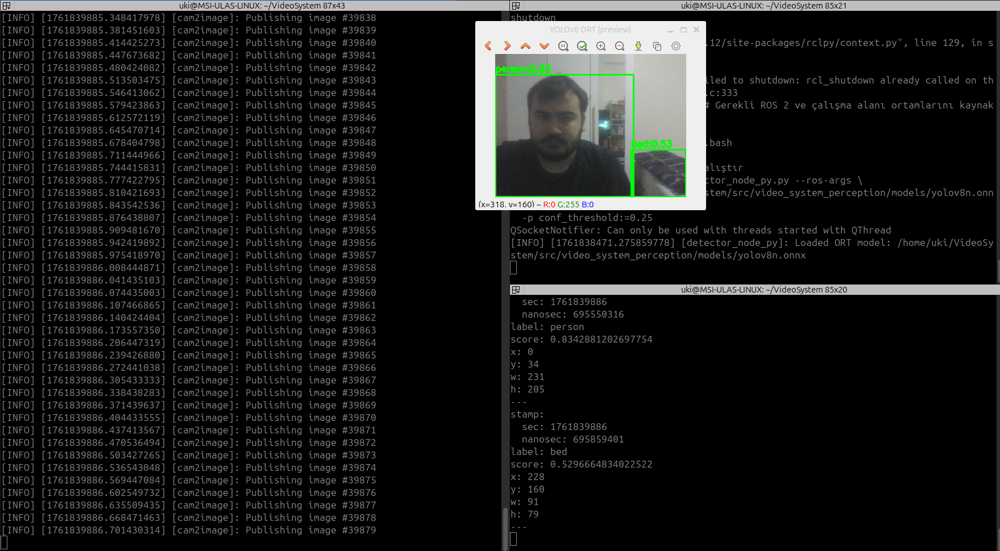

---

# VideoSystem

**VideoSystem**, ROS 2 (Jazzy Jalisco) tabanlı modüler bir görüntü işleme altyapısıdır.
Sistem, bilgisayar kamerasından alınan görüntüleri işler ve tespit/olay bilgilerini ROS 2 mesajları olarak yayınlar.
Mimari; **YOLOv8 + ONNX Runtime dedektörü**, özetleme ve olay analizi gibi modüllerle büyümeye uygundur.

---

## 1) Öne Çıkanlar

* **YOLOv8 dedektörü (Python + ONNX Runtime)** – OpenCV-DNN yerine resmi ORT ile uyumlu ve stabil.
* **COCO sınıf etiketleri** – `/events`’te anlamlı `label` alanı (örn. `person`, `bed`).
* **Kolay entegrasyon** – Paketler ayrı; `interfaces / core / perception / bringup`.
* **Esnek koşum** – Dedektör **ros2 run kullanılmadan** doğrudan çalıştırılır.
* **Görselleştirme** – İsteğe bağlı önizleme penceresi (`visualize:=true`).

---

## 2) Klasör Yapısı

```
VideoSystem/
└─ ros2_ws/
   └─ src/
      ├─ video_system_interfaces/     # Event.msg vb.
      ├─ video_system_core/           # örnek C++ node (ImageEventNode)
      ├─ video_system_bringup/        # launch + param dosyaları
      └─ video_system_perception/     # YOLOv8 (Python + ORT) dedektörü
         ├─ scripts/detector_node_py.py
         └─ models/yolov8n.onnx
```

---

## 3) Gereksinimler

* Ubuntu 22.04/24.04
* ROS 2 **Jazzy Jalisco**
* `colcon` ve ROS demo paketleri

```bash
sudo apt update
sudo apt install -y ros-jazzy-desktop ros-jazzy-image-tools \
  python3-colcon-common-extensions python3-opencv python3-yaml
```

**ONNX Runtime (gerekirse):**

```bash
# ROS2 ile uyum için NumPy 2 yerine 1.x önerilir
python3 -m pip install --break-system-packages 'numpy<2' onnxruntime
```

---

## 4) Klonlama ve Build

```bash
git clone git@github.com:ukis666/VideoSystem.git
cd VideoSystem/ros2_ws

source /opt/ros/jazzy/setup.bash
colcon build --symlink-install --cmake-args -DCMAKE_BUILD_TYPE=Release
```

### Önerilen overlay (tek satır)

Bu depo için tercih edilen overlay sırası:

```bash
source /opt/ros/jazzy/setup.bash && \
VS_PREFIX="$HOME/VideoSystem/ros2_ws/install" && \
export AMENT_PREFIX_PATH="$VS_PREFIX:${AMENT_PREFIX_PATH:-}" && \
export AMENT_INDEX_RESOURCE_PATH="$VS_PREFIX/share/ament_index:${AMENT_INDEX_RESOURCE_PATH:-}" && \
[ -d "$VS_PREFIX/lib/python3.12/site-packages" ] && \
export PYTHONPATH="$VS_PREFIX/lib/python3.12/site-packages:${PYTHONPATH:-}"
```

> Not: Çalıştırma adımlarında da bu overlay’in aktif olması gerekir.


---


## 5) Çalıştırma

Aşağıdaki üç terminal akışı önerilir.

### Terminal A — Kamera yayıncısı

```bash
source /opt/ros/jazzy/setup.bash
source ~/VideoSystem/ros2_ws/install/setup.bash

ros2 run image_tools cam2image \
  --ros-args -p video_device:=/dev/video0 \
  -r /image:=/camera/image_raw
```

### Terminal B — **Dedektör (Python + ONNX Runtime)**

**Dikkat:** Bilinçli olarak **ros2 run bende hata verdiğinden bypass edilerek kullanılmıştır**. Binary **doğrudan** çalıştırılır.

```bash
source /opt/ros/jazzy/setup.bash
source ~/VideoSystem/ros2_ws/install/setup.bash

# Workspace'in kurulu olduğu yerden path değişebilir.
VS_INSTALL="$HOME/VideoSystem/ros2_ws/install"

"$VS_INSTALL/video_system_perception/lib/video_system_perception/detector_node_py.py" \
  --ros-args \
  -p model_path:="$HOME/VideoSystem/ros2_ws/src/video_system_perception/models/yolov8n.onnx" \
  -p visualize:=true \
  -p conf_threshold:=0.25
```

> İzin hatası görürsen:
> `chmod +x "$VS_INSTALL/video_system_perception/lib/video_system_perception/detector_node_py.py"`

### Terminal C — Olayları izle

```bash
source /opt/ros/jazzy/setup.bash
source ~/VideoSystem/ros2_ws/install/setup.bash

ros2 topic echo /events
```

Örnek `/events` mesajı:

```
stamp:
  sec: 1716183986
  nanosec: 695550316
label: person
score: 0.83
x: 34
y: 0
w: 231
h: 205
```


## Örnek Çalışma (YOLOv8 ORT + `/events`)

<p align="center">
  
</p>

Üç terminal akışı:
1) `cam2image` ile `/camera/image_raw` yayını  
2) **Dedektör** (ros2 runsız hali):
   ```bash
   source /opt/ros/jazzy/setup.bash
   source ~/VideoSystem/ros2_ws/install/setup.bash
   "$HOME/VideoSystem/ros2_ws/install/video_system_perception/lib/video_system_perception/detector_node_py.py" \
     --ros-args \
     -p model_path:="$HOME/VideoSystem/ros2_ws/src/video_system_perception/models/yolov8n.onnx" \
     -p visualize:=true \
     -p conf_threshold:=0.25


---

## 6) Parametreler (dedektör)

| Adı              | Tip    | Varsayılan | Açıklama                                 |
| ---------------- | ------ | ---------- | ---------------------------------------- |
| `model_path`     | string | zorunlu    | ONNX model yolu                          |
| `visualize`      | bool   | `true`     | Önizleme penceresi                       |
| `conf_threshold` | float  | `0.45`     | Eşik (README örneğinde `0.25` kullandık) |
| `nms_threshold`  | float  | `0.50`     | NMS eşiği                                |

---

## 7) Sık Karşılaşılan Sorunlar

* **`Permission denied`:** Dedektör dosyasına yürütme izni verin:
  `chmod +x <...>/detector_node_py.py`
* **`Package '...perception' not found`:** Overlay’i doğru sıralamada aktif edin (yukarıdaki tek satırı kullanın).
* **NumPy/`cv_bridge` uyumsuzluğu:** `numpy<2` kurulu olduğundan emin olun:
  `python3 -m pip install --break-system-packages 'numpy<2'`
* **Model bulunamadı:** `model_path` değerini mutlak ve doğru yol olarak verin.
* **OpenCV DNN hataları:** Dedektör artık **ONNX Runtime** kullanır; OpenCV-DNN ile çalıştırmayın.

---

## 8) Yol Haritası

* `/detections` ve `/summary` mesajları
* ByteTrack/OC-SORT tabanlı izleyici
* SQLite tabanlı olay kaydı
* Çoklu düğüm launch ve servis arayüzleri


---

## 9. Gelecek Çalışmalar

* **Algılama → Takip (Tracking)**

  * `Detection.msg` / `DetectionArray.msg` tabanlı **/detections** konusunu standartlaştırma.
  * ByteTrack / OC-SORT entegrasyonu ile **/tracks** (id, sınıf, skor, bbox, hız) yayını.
  * Sahnede ROI/Zona desteği (sadece belirli bölgelerde alarm).

* **Performans & Çalıştırma Seçenekleri**

  * ONNX Runtime **Execution Provider** seçimi için parametre: `providers := ['CPUExecutionProvider']` → opsiyonel **CUDA / TensorRT / OpenVINO**.
  * Yarı-kesinlik (FP16), dinamik `imgsz`, daha hızlı NMS ve vektörize post-process.
  * FPS, gecikme, GPU/CPU kullanımını yayınlayan **/metrics** düğümü.

* **Model Yönetimi**

  * `models/` altına indir-doğrula-basitleştir (onnxsim) işlemlerini yapan **model_manager** betiği.
  * Model sürümü/etiket eşlemesi ve otomatik bütünlük (SHA256) kontrolü.

* **Kayıt & Analiz**

  * **SQLite** tabanlı `events.db` (zaman damgası, sınıf, skor, bbox, kaynak).
  * **rosbag2** ile ham görüntü ve /events eşzamanlı kaydı; offline yeniden oynatma.
  * Basit bir **Event Dashboard** (rqt plugin veya küçük bir web UI).

* **Çoklu Kamera / Ad Alanı**

  * Birden fazla kamerayı `namespace` ile paralel çalıştırma.
  * `camera_info` ve homografi ile dünya koordinatına izdüşüm (zemin planına kutu çizimi).

* **Yapılandırma & Kullanılabilirlik**

  * Tüm parametrelerin YAML ile yönetimi (eşik, sınıf filtreleri, yayın oranları).
  * Çalışırken değiştirilebilir parametreler (**dynamic parameters**).
  * `bringup.launch.py` içinde profil seçimi: *debug / perf / headless*.

* **Kalite Güvencesi (CI/CD)**

  * GitHub Actions: `colcon build`, `ament_lint`, `pytest`, paket boyutu/bağımlılık denetimi.
  * **pre-commit** kancaları (black/isort/clang-format + yamllint).

* **Dağıtım**

  * **Dockerfile** (ros:jazzy tabanlı), **devcontainer**.
  * `systemd` servis betiği (oturum açmadan başlatma).
  * ARM64 (Raspberry Pi 5) ve Jetson için derleme profilleri.

* **Sağlamlık & Güvenlik**

  * QoS ayarları (keep_last, depth, reliability) ve geri basınç kontrolü.
  * İzleme/yeniden başlatma (watchdog), düzgün kapatma (SIGINT/SIGTERM).
  * Hata/istisna metriki ve uyarı sistemi.

* **ROS 2 Bileşenleştirme**

  * Composable Node yapısına geçiş; tek süreçte çok düğüm.
  * Ortak görüntü işleme hatları (normalize, letterbox) için yeniden kullanılabilir bileşenler.

---


## 10. Yazarlar

**ULAS S.**
GitHub: [ukis666](https://github.com/ukis666)
**GOKTURK C.**
GitHub: [GokturkCan](https://github.com/GokturkCan)


